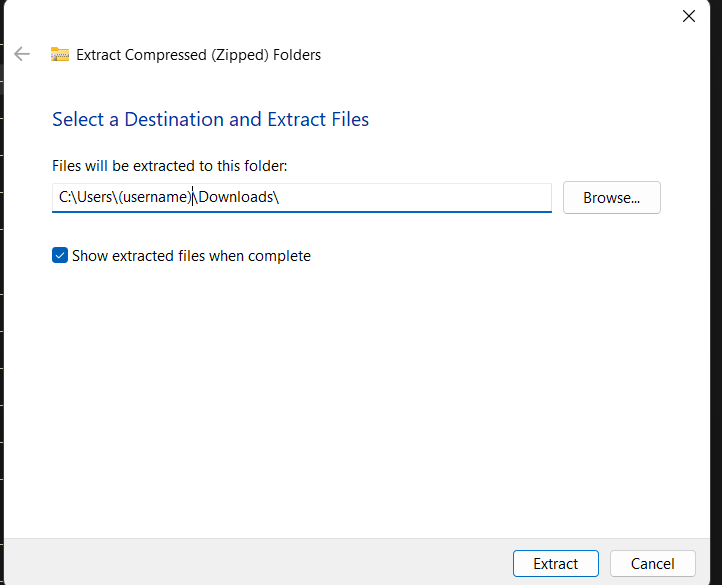
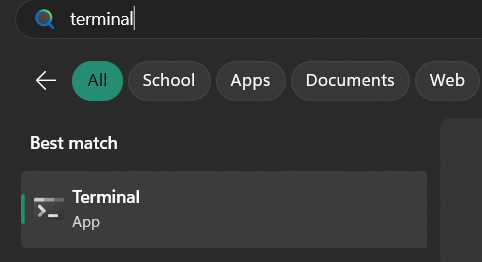
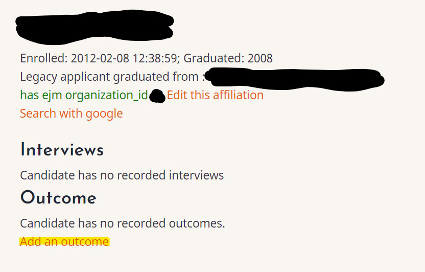
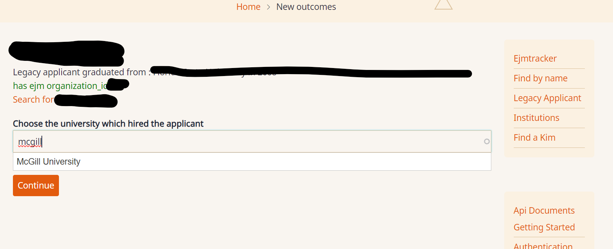
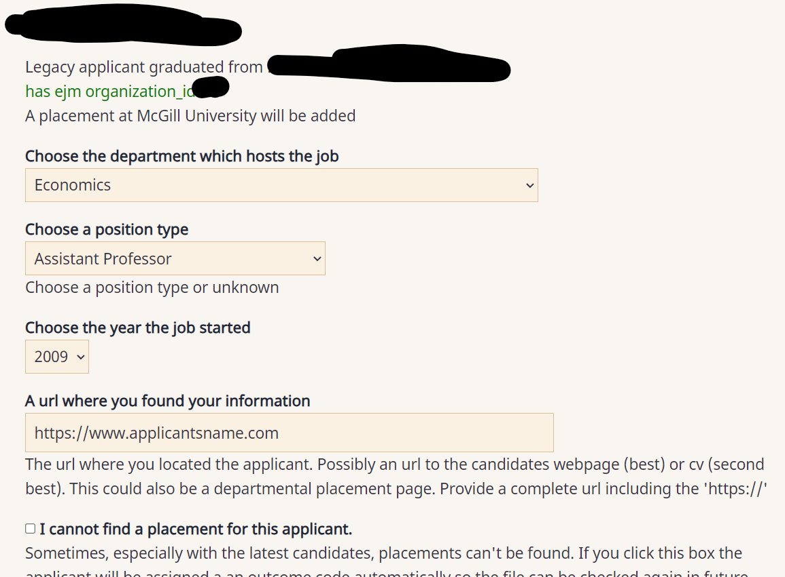
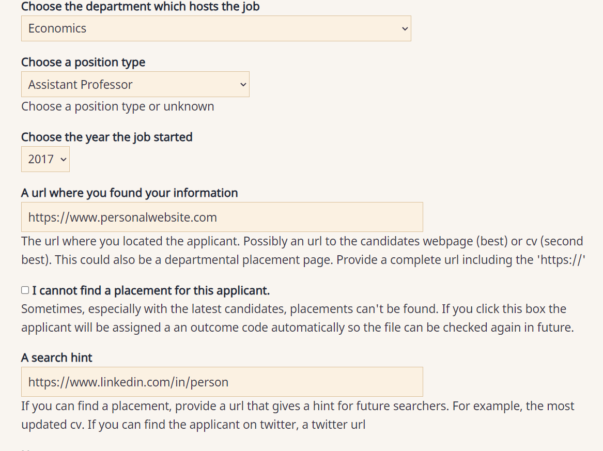
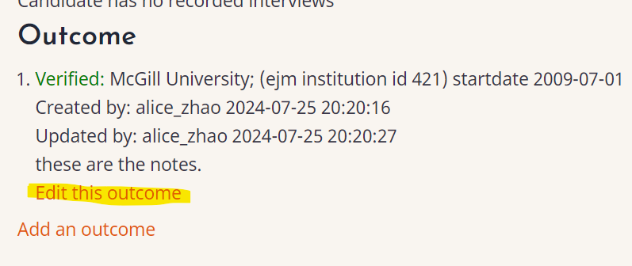
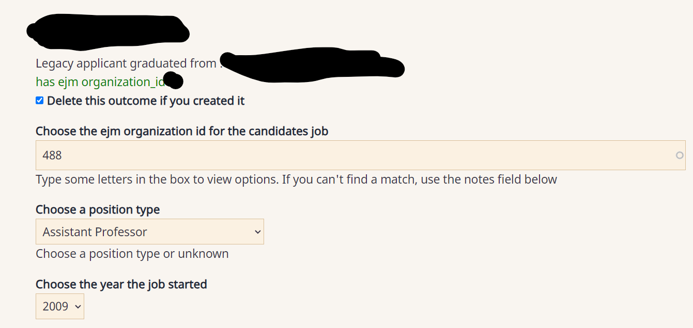
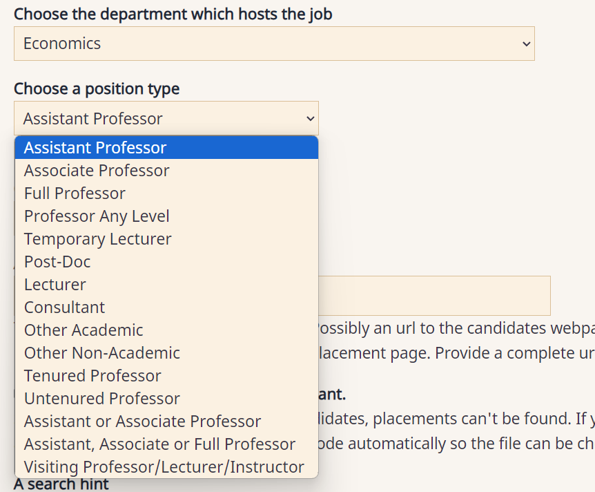

Tali Yaffe and Jonathan Chan   
July 26, 2022

# EconJobMarket Data Entry Guide

Welcome! If you are reading this guide, thank you for your interest in helping to work on EconJobMarket (referred to as EJM below), a database to match PhD graduates with employment opportunities. Over the years, tens of thousands of PhD candidates and graduates from all around the world have used EJM; which means that, as a side effect, EJM has also collected data that can be used for research. The research team at UBC, specifically, is investigating the relationship between the PhD-conferring institution and the institution that hires these PhD graduates (called applicants or candidates). 

In order to better track applicant outcomes from the PhD-conferring institution to the hiring institution, we need volunteers to manually search for applicants and add their outcomes to the database. This guide will cover how to do that, as well as how to solve some common problems you may encounter in the process of adding outcomes.

## Setting up the VSE Data Entry Tool

Before making any entries, you will need to have the VSE Data Entry Tool installed on your computer. The tool was originally created by Kieran Weaver, and was modified by Jonah Heyl. It enables you to quickly search for the job placement outcomes of economics PhD graduates in the EJM database. It automatically launches the [EJM support site](https://support.econjobmarket.org) with three different candidate pages, along with corresponding web search tabs for their CVs. 

### Prerequisites
You must be logged into your account on https://support.econjobmarket.org before using this tool. If you are a first-time user, you should have received credentials through email. The login page can be accessed through this [link](https://support.econjobmarket.org/user/login). As well, you must have Python installed on your computer.

### Downloading the File
1. Go to https://github.com/Jonah-Heyl/EJM_button.
2. Click the green icon titled "Code", then select "Download ZIP" from the dropdown menu.
3. Save the folder "EJM_button-main" to your preferred directory (we will use the Downloads folder in this example).
4. Unzip the file and place it in the downloads folder. 
Windows: To do this, right click on the zip file and click "Extract all". Then, following this example, write the following path:
 

### Launching the Tool

1. Open Terminal. Type in `cd /Users/username/Downloads/EJM_button-main`, then hit enter.
 
2. Type in `python vse_data_entry_tool.py`, then hit enter.
3. A new window will appear with a button that says "Add slice". Click this button. 
4. In the Terminal window, you will be prompted to enter the username for your account on https://support.econjobmarket.org. Type it in, then hit enter.
 
5. You will then be prompted to enter the password for your account on https://support.econjobmarket.org. Type it in, then hit enter.
6. Three tabs with candidate pages on the EJM support site will launch in your web browser, along with three web search tabs for the candidates' CVs. 

Once logged in, the script will create a file called "user.dat", which will be saved on your computer. This file stores your login credentials, as well as the latest access token. If you delete this file, you will be prompted to log in again once your access token expires. 

## Step-by-Step Guide to Adding Outcomes

Now that the candidate pages have launched in your browser, you are ready to begin inputting the outcomes.   
**Note:** Sensitive information in this example has been blurred out for data privacy reasons.

1. Look through the web search tab and try to find information relating to the candidate. Some examples of common resources include applicants’ personal websites, LinkedIn profiles, academic CVs, or profiles of applicants posted on organisational websites. When using resources, it is crucial to **verify** the applicant’s identity, to ensure that both the graduation year (if available) and degree-granting institution match up with the data recorded in EJM. This is because applicants often have the same names, including both first and last. It is better to not record data than to record incorrect outcomes.
2. Once you have found an outcome and verified that the data belongs to the applicant, record it in EJM. Click on the “Add an outcome” button. 
 
**Note:** For the purposes of this example, the applicant currently works at Harvard University as an Assistant Professor.
3. Once you click on the “Add an outcome” button, you should arrive at a prompt for you to type in the university which hired the applicant. Start typing in the university name, and the correct institution should appear. Example: 

4. Click on the correct institution, and then “Continue.”
5. Choose the department of the university at which the applicant’s outcome is in (if applicable), as well as the position type and starting year. Example:

6. Insert links to where you found the information on the applicant’s outcomes. You can add a search hint if you would like. 

7. Double-check that the applicant’s outcome is in the correct institution (see above image: you can check on top where it says “A placement at [institution] will be added). Add any notes if necessary, and then click “Update the applicant's outcome.”
8. The outcome should now be added! You should be redirected to the applicant’s main page. Something like this: 

9. Add any other outcomes for the applicant. For example, if the applicant was also a Postdoctoral Researcher at Harvard University, and an Economist at the European Central Bank, both of them will also need to be added. Please add **all post-PhD outcomes** for an applicant (even if they don’t seem to be in the field of economics!), **except** if they are positions within a scientific journal. 
10. Please note that position changes within an institution should be recorded as separate outcomes.

### Deleting outcomes

**Note:** You cannot delete outcomes that you did not make. 

1. To delete an outcome you made, press the highlighted “Edit this outcome”.

2. Check the “Delete this outcome if you created it” box. 

3. Press “Update the applicant's outcome”. 

### Finding candidates
Sometimes, it is hard to find new candidates to fill information for.

* Go to `https://support.econjobmarket.org/tracker` and type in the name of an institution and the year (which indicates when an applicant registered with econjobmarket).
  * Often times, candidates from 10+ years ago were missed. Check those years.
* Lower tier institutions are often missed. (insert link to list of institutions) and `ctrl + f` and type 4 or 5 to find lower tier institutions to type into the tracker page. 
* Of course, you can always use the VSE data entry tool.

### Common Problems and Q&A

* In which cases should we enter the applicant's position? 
  * If the position started in and after 2008 and after their PhD graduation, and is not a position at a scientific journal. You should enter all such outcomes for each applicant. Please note that it is preferred if you do not enter information for candidates that have just graduated the present year. 
* The position type of the applicant is not in the list of positions!
  * In this case, you should select either “Other Academic” (if the position is in a university) or “Other Non-Academic” (if the position is in any other institution type). For example: 
  
* I can’t find the institution that hired the applicant!
  * In this case, you should put “Ocean and Crow Studios Inc” as the institution, then note in the “Notes” section the exact institution that hired the applicant. 
  
* I can’t find any outcomes for this applicant!
  * If that is the case, please click on “Add a new outcome,” select “Ocean and Crow Studios Inc,” and then select this checkbox: 
  
   This will place the applicant into a list for future reference.
* What is a senior lecturer?
  * In some British, Australian, or other Commonwealth nations, a different professorial staff system may be used in place of the North American track of assistant -> associate -> full professor. Instead, “lecturer -> senior lecturer” may be used. If you have any doubts, please consult this [list](https://docs.google.com/spreadsheets/d/13A-F1BIrgPelg9SAhC-zs8GkukMEgA9puxdXCtMLw8M/edit#gid=0) of universities and whether they use the lecturer or professor system. If a university uses the lecturer system, please convert the rank to the North American system before inputting the outcome into EJM. Oftentimes, applicants whose institutions use this system will provide the North American equivalent of their job title in their CVs.
* The applicant started a position before they graduated, but they still hold the same job.
  * This depends on the position they take. If it is a lecturer/postdoc or anything that graduates would be employed in, it is best to record it. If unsure, check with your leader.
* The applicant's graduation date is different on their personal website/LinkedIn than on the system.
  * Add a note about it in the notes of one of their outcomes. Do not change it. 
* When to use “Consulting” and when do we use “Other Non-Academic”?
  * If the candidate is working for a consulting company, and has a consulting position, then use "Consulting".
* What if we aren't sure about the start date?
  * If it is a position that candidates get after graduation, such as post-doc, or assistant professor, you can use the graduation date on the candidate's outcome page as an estimate. 
* What do we do with duplicate accounts?
  * Ensure that you enter entries on only one of the accounts. 
* Do we enter outcomes that haven't occurred yet? 
  * Yes. If an applicant is hired for next year or any future year, enter the outcome. 

## Navigating the Support Site
* **Applicant Database:** A list of all the applicants on EconJobMarket. Can filter the applicants by their registration date, institution they obtained their PhD from, and whether they have any outcomes recorded.
* **Institutions:** A list of the top 100 institutions, sorted by rank. 
* **FindApplicantByName:** Can search for specific applicants by their last name. 
* **Find a Kim:** Clicking this link opens the page of an applicant who has an incomplete entry. Incomplete entries can be fixed on this page.
* **Find a Legacy Applicant:** Clicking this link opens the page of a Legacy Applicant who has an incomplete entry. Incomplete entries can be fixed on this page. You will have to enter their graduate school

## Making Modifications to the VSE Data Entry Tool
Open the file `vse_data_entry_tool.py` in your preferred editor. 

* **Changing the search criteria:** Line 32 contains the following code: `SEARCH = "https://www.google.com/search?q={}+{}+economics+cv"`. To search for something else, such as a LinkedIn profile, simply change the `+cv` to `+LinkedIn`.  

* **Changing the number of candidates displayed at a time:** First modify Line 31. For example, if you want to search for 5 candidates, change `slice_length=3` to `slice_length=5`. Next, change the code in Line 191 from `for i in range(0,3)` to `for i in range(0,5)`.

Save the modified file, open a new Terminal window, and then repeat the steps in "Launching the Tool" to perform a search with the new criteria.
